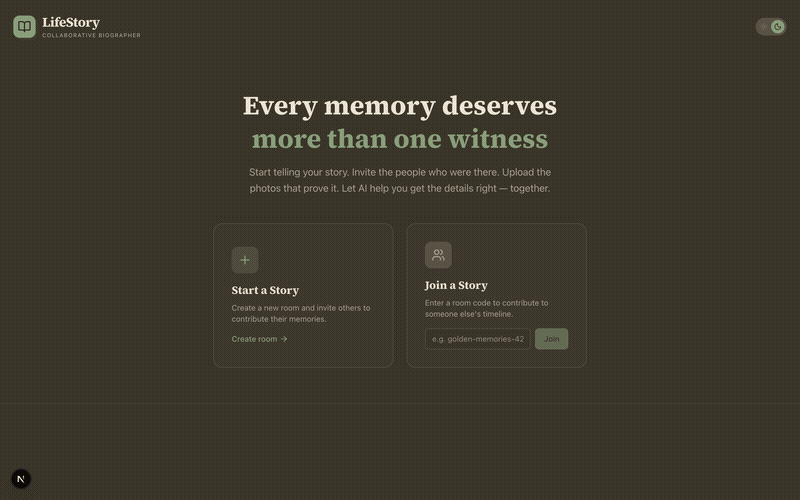
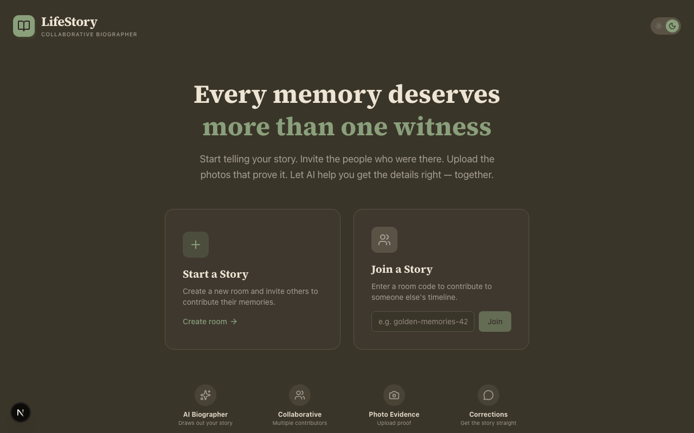
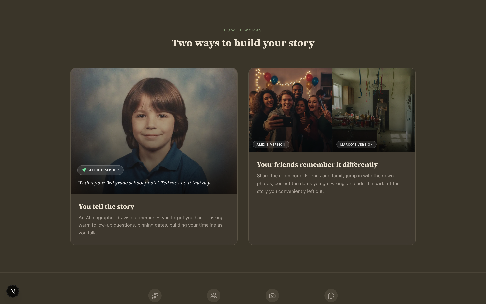
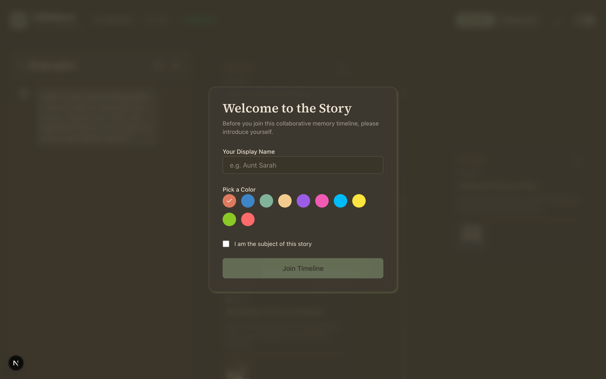
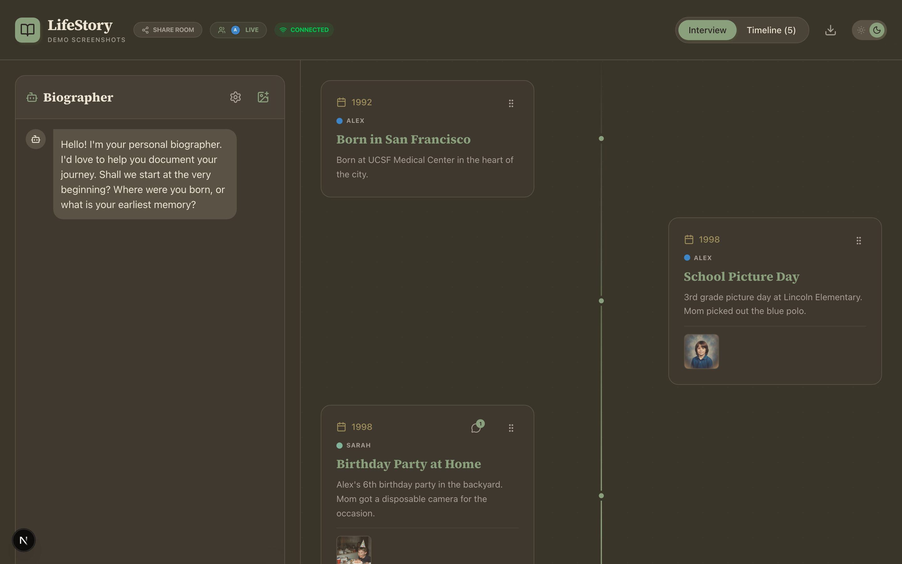

# LifeStory

An AI biographer that interviews you about your life and builds a collaborative timeline as you talk. Invite the people who were there — your siblings, your college roommate, your parents — and let them add their own memories, upload photos, and correct the details you got wrong. Because we all remember things differently, and that's kind of the point.

## Quick Start

```bash
git clone https://github.com/andrewvoirol/ais-lifestory-interactive-life-timeline.git
cd ais-lifestory-interactive-life-timeline
npm install
```

Create `.env.local` with your [Gemini API key](https://aistudio.google.com/apikey):

```
NEXT_PUBLIC_GEMINI_API_KEY=your_key_here
```

```bash
npm run dev
```

Open [localhost:3000](http://localhost:3000). Click "Start a Story." Share the room code with the people who were there.

## How It Works

1. **Start or join a room** — get a shareable code like `golden-memories-42`
2. **Talk to the biographer** — it asks warm, probing follow-up questions and streams responses in real-time
3. **Watch your timeline build** — the AI extracts dates, titles, and descriptions from your conversation and drops them onto a draggable timeline
4. **Invite contributors** — share the room code, each person picks a name and color
5. **Argue about the details** — comment on events, mark corrections ("No, that was 1997, not 1998"), drag things to the right spot
6. **Upload the evidence** — attach photos to events, see who uploaded what

Under the hood: Gemini 2.5 Flash handles the interview, event extraction (structured JSON), image analysis, and text-to-speech. Events persist to per-room JSON files and broadcast via Server-Sent Events so everyone stays in sync.

## Screenshots

| Landing Page | How It Works |
|:---:|:---:|
|  |  |

| Join a Room | In the Room (with photos) |
|:---:|:---:|
|  |  |

## Features

- 🎙️ **AI Biographer** — warm, empathetic interviewer that draws your story out one question at a time
- ⚡ **Streaming Responses** — token-by-token rendering with blinking cursor and stop button
- 🏠 **Room System** — shareable room codes, each room has its own timeline and contributors
- 👥 **Contributor Identity** — pick a name and color, see who contributed what
- 💬 **Comments & Corrections** — inline threads on events, "Corrected 3 times" badges with history
- 📷 **Photo Upload** — attach photos to events, see who uploaded each one
- 🟢 **Live Presence** — see who's online in real-time via SSE
- 📅 **Auto Event Extraction** — structured JSON extraction detects life events from natural conversation
- 🖼️ **Photo Analysis** — upload a photo, AI describes the memory and adds it to the timeline
- 🔊 **Text-to-Speech** — hear the biographer's responses in 5 selectable voices
- ✨ **Drag & Reorder** — rearrange timeline events with smooth motion animations
- 🌓 **Light/Dark Mode** — polished oklch color palette for both themes
- 📥 **Export** — download your timeline as a text file
- 🎊 **Confetti** — because every memory deserves a celebration

## Tech Stack

| Layer | Stack |
|-------|-------|
| **Framework** | Next.js 15 (App Router) |
| **Language** | TypeScript 5.9 |
| **Styling** | Tailwind CSS v4, oklch design tokens, light/dark theme |
| **Animation** | Motion (Framer Motion successor) — drag-and-drop reorder, page transitions |
| **AI** | Gemini 2.5 Flash (chat, image analysis, TTS) via `@google/genai` |
| **Fonts** | Merriweather, Source Serif 4, JetBrains Mono |
| **Real-time** | Server-Sent Events for room-scoped multi-user sync |
| **Other** | canvas-confetti, react-markdown, lucide-react |

## Architecture

```
app/
  page.tsx                      — Landing page (create/join rooms)
  layout.tsx                    — Root layout, fonts, dark-mode hydration
  globals.css                   — Tailwind v4 config, oklch design tokens
  room/[roomId]/page.tsx        — Room-scoped app (chat + timeline + collaboration)
  api/rooms/[roomId]/events/    — Per-room SSE + CRUD API

components/
  Chat.tsx                      — AI interview with streaming, TTS, event extraction
  Timeline.tsx                  — Draggable timeline with comments, photos, corrections
  ContributorIdentity.tsx       — Name/color picker modal + useContributor hook
  ContributorPanel.tsx          — Slide-out contributor presence sidebar
  EventComments.tsx             — Inline comment threads with correction tracking
  PhotoGallery.tsx              — Photo strip thumbnails + full lightbox viewer
  ImageAnalyzer.tsx             — Photo upload → AI analysis → timeline event
  ThemeToggle.tsx               — Animated light/dark toggle

lib/
  types.ts                      — Shared TypeScript interfaces (LifeEvent, Contributor, etc.)
  gemini.ts                     — AI client, streaming, system prompt, image analysis, TTS
```

## License

MIT
