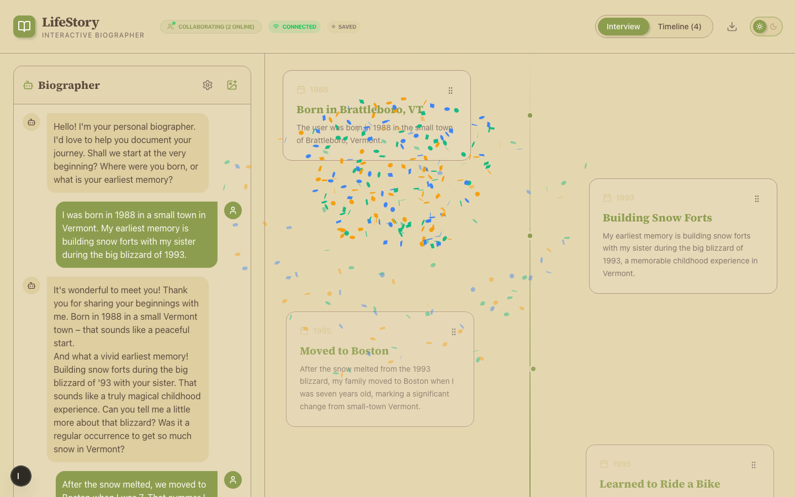
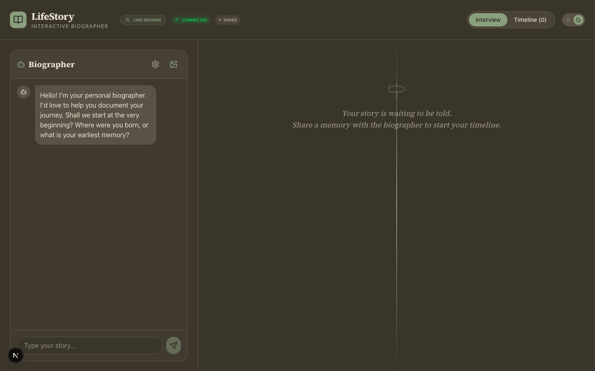
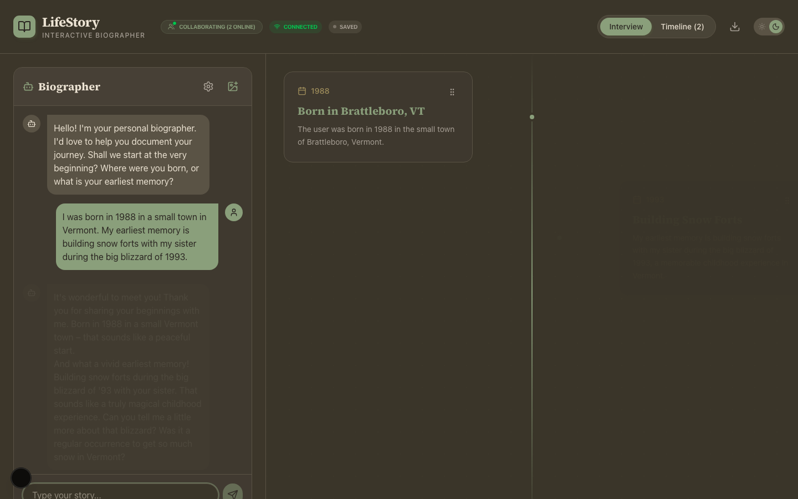

# LifeStory

An AI-powered biographer that interviews you about your life, draws out memories you forgot you had, and builds a beautiful, draggable timeline as you talk. Because the way you remember your past isn't always the way others experienced it with you — and some moments are too incredible to let fade.

Use it to document your own story. Bring it to a wedding. Build a memorial. Let someone who's lost pieces of their past rebuild them with help from the people who were there.

## Quick Start

```bash
git clone https://github.com/andrewvoirol/ais-lifestory-interactive-life-timeline.git
cd ais-lifestory-interactive-life-timeline
npm install
```

Create `.env.local` with your [Gemini API key](https://aistudio.google.com/apikey):

```
NEXT_PUBLIC_GEMINI_API_KEY=your_key_here
```

```bash
npm run dev
```

Open [localhost:3000](http://localhost:3000). Start talking.

## How It Works

Share a memory with the biographer. It listens, asks follow-ups, and when it recognizes a life event, it extracts it — title, date, description — and drops it onto your timeline with a burst of confetti. Upload photos and the AI will analyze them for context. Drag events to reorder. Click dates to edit. Open multiple tabs and watch them sync in real time.

Under the hood: Gemini 2.5 Flash handles the interview, event extraction (via structured JSON output), image analysis, and text-to-speech. The timeline persists to a local JSON file and broadcasts updates via Server-Sent Events so multiple clients stay in sync.

## Screenshots

| Initial State | Active Interview |
|:---:|:---:|
|  |  |

## Tech Stack

| Layer | Stack |
|-------|-------|
| **Framework** | Next.js 15 (App Router) |
| **Language** | TypeScript 5.9 |
| **Styling** | Tailwind CSS v4, oklch design tokens, light/dark theme |
| **Animation** | Motion (Framer Motion successor) — drag-and-drop reorder, page transitions |
| **AI** | Gemini 2.5 Flash (chat, image analysis, TTS) via `@google/genai` |
| **Fonts** | Merriweather, Source Serif 4, JetBrains Mono |
| **Real-time** | Server-Sent Events for multi-tab/multi-user sync |
| **Other** | canvas-confetti, react-markdown, lucide-react |

## Features

- 🎙️ **AI Interviewer** — warm, empathetic biographer that draws out your story one question at a time
- 📅 **Auto Event Extraction** — structured JSON extraction detects life events from natural conversation
- 🖼️ **Photo Analysis** — upload a photo, AI describes the memory and adds it to the timeline
- 🔊 **Text-to-Speech** — hear the biographer's responses in 5 selectable voices
- 🔄 **Real-time Sync** — SSE-based broadcasting keeps multiple tabs/users in sync
- ✨ **Drag & Reorder** — rearrange timeline events with smooth motion animations
- 🌓 **Light/Dark Mode** — polished oklch color palette for both themes
- 📥 **Export** — download your timeline as a text file
- 🎊 **Confetti** — because every memory deserves a celebration

## Architecture

```
app/
  layout.tsx          — Root layout, fonts, dark-mode hydration
  page.tsx            — Split-pane (desktop) / tabbed (mobile) layout
  globals.css         — Tailwind v4 config, oklch design tokens
  api/events/route.ts — SSE endpoint + CRUD (in-memory + file persistence)

components/
  Chat.tsx            — AI interview chat with TTS, settings, event extraction
  Timeline.tsx        — Draggable timeline with reorder, inline editing, delete
  ImageAnalyzer.tsx   — Photo upload → AI analysis → timeline event
  ThemeToggle.tsx     — Animated light/dark toggle

lib/
  gemini.ts           — AI client, system prompt, image analysis, TTS
```

## License

MIT
